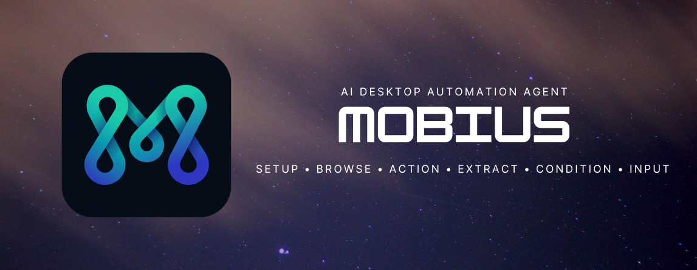

<div align="center">
  
</div>

## Overview

Mobius brings the power of intelligent computer-use agents directly into your VS Code environment. Build, test, and run complex desktop automation workflows natively without leaving your editor.

Unlike traditional pixel-based automation tools, Mobius uses a native UI tree extraction engine to "see" your desktop interfaces precisely. Combined with Large Language Models, Mobius acts as a deterministic, steppable agent.

## Features

- **Native VS Code Integration**: Launch the Mobius visual dashboard directly inside a VS Code webview. The interface matches your active theme flawlessly.
- **No External Servers Required**: Mobius manages a lightweight, localized Python engine securely through standard data streams (JSON-RPC) without relying on local HTTP servers or Docker containers.
- **Node-Based Workflow Builder**: Construct workflows visually. Chain actions together logically—Browse, Action, Extract, Condition, and Input.
- **Pure Python Execution Engine**: Mobius's computer-use engine runs completely via native Python UI hooks.

## Architecture

Mobius is designed in two perfectly synced layers:
1. **Extension Host (TypeScript/React)**: Handles the node-based UI and manages VS Code integrations.
2. **Execution Engine (Python)**: A robust, in-sourced workflow engine that interacts directly with your OS natively.

## Installation

*(Coming soon to the VS Code Marketplace!)*

**To build from source:**
1. Clone this repository and open the `mobius_core` folder in VS Code.
2. Ensure you have Python 3.10+ installed on your system.
3. Open a terminal and run:
   ```bash
   npm install
   npm run build --prefix webview-ui
   npm run compile
   ```
4. Press `F5` to open the Extension Development Host.
5. Open the Command Palette (`Ctrl+Shift+P`) and type `Mobius: Open Dashboard`. 
   > Note: Mobius will automatically set up its own virtual environment (`.venv`) and install dependencies on the first run.

## Usage Example

Mobius breaks execution into independent, LLM-powered steps:
* `Setup`: Pre-workflow node to configure system packages or dependencies.
* `Browse`: Open a browser or target application.
* `Action`: Perform a specific desktop action (e.g., "Click on the login button").
* `Extract`: Read and extract structured data into JSON from the screen.
* `Condition`: Conditionally branch your workflow.
* `Input`: Fill forms or text fields dynamically.

Create these steps visually using the drag-and-drop dashboard. When you click **Run**, the Extension Host securely passes the graph to the Python engine for execution.

## Requirements

Currently, Mobius utilizes Google's Gemini models for its vision and action capabilities. Ensure you have your `GEMINI_API_KEY` set in your system environment variables before launching VS Code.

## License

Mobius is open-source software licensed under the [Apache 2.0 License](LICENSE).
